# 🤖 AI Communication Coach

[](https://opensource.org/licenses/MIT)
[](https://www.python.org/downloads/)
[](https://gradio.app)
[](https://openai.com)

An AI-powered application that acts as a personal public speaking advisor. Upload a video of yourself speaking, and the AI will perform a holistic analysis of your communication skills, providing a comprehensive report with actionable feedback to help you improve.

---

## ✨ Features

- **Multimodal Analysis:** The coach analyzes both verbal and non-verbal communication channels:
    - **🎭 Visual Analysis:** Detects facial expressions and emotions through computer vision techniques
    - **👁️ Eye Contact:** Measures how consistently you look at the camera
    - **📝 Speech Analysis:** Transcribes speech and analyzes pacing (WPM), use of filler words, and sentiment
    
- **Comprehensive Reports:** Generate detailed assessments with:
    - **📊 Emotion Distribution:** Visual radar charts showing expression variety
    - **📈 Speech Metrics:** Word count, pace, filler word frequency
    - **🖼️ Expression Samples:** Visual examples of your different facial expressions
    
- **Actionable Feedback:** Receive personalized suggestions for improvement in:
    - **🗣️ Speaking Style:** Pace, filler word reduction, speech clarity
    - **😊 Emotional Expression:** Expressiveness, variety, appropriateness
    - **📹 Camera Presence:** Positioning, eye contact, engagement

## 🛠️ Tech Stack & Architecture

This project orchestrates several state-of-the-art open-source technologies:

- **Backend:** **Python**
- **AI / Machine Learning:**
    - **Speech Recognition:** `openai-whisper` for accurate speech-to-text
    - **Sentiment Analysis:** Hugging Face `transformers` for text sentiment evaluation
    - **Computer Vision:** `OpenCV` for face detection and expression analysis
- **Visualization:** `matplotlib` for data visualization and charting
- **Frontend Interface:** `gradio` for interactive web UI
- **Media Processing:** `ffmpeg-python` for audio extraction

### System Workflow

The application follows a streamlined data processing pipeline:

```mermaid
graph TD
    A[🎥 Video Upload] --> B{Extract Audio};
    B --> C[🎧 Audio File];
    A --> D[🎞️ Video Frames];

    subgraph "Parallel Analysis"
        D --> E[👁️ OpenCV: Facial Analysis & Emotion Detection];
        C --> G[📝 Whisper: Speech-to-Text];
    end

    G --> H[🧐 Text Analysis: Pace, Fillers, Sentiment];

    subgraph "Data Integration"
        E --> I{🧠 Analysis Engine};
        H --> I;
    end

    I --> J[📊 Generate Visual Reports & Suggestions];
    J --> K[🖥️ Display in Gradio Interface];
```



## 🚀 Getting Started

### Prerequisites
- Python 3.8+
- FFmpeg installed on your system

### Installation

1. Clone the repository:
```bash
git clone https://github.com/yourusername/ai-communication-coach.git
cd ai-communication-coach
```

2. Install the required dependencies:
```bash
pip install -r requirements.txt
```

3. Run the application:
```bash
python app.py
```

The web interface will be available at http://localhost:7860

## 📋 Usage Guide

1. **Upload Your Video**: Use the upload button or record directly in your browser
2. **Wait for Processing**: The AI will analyze your video (this may take a few moments)
3. **Review Your Report**: Explore the comprehensive analysis of your presentation
4. **Implement Feedback**: Apply the personalized suggestions to improve your skills

## 🔍 Analysis Components

The AI Communication Coach provides a detailed assessment including:

- **Speech Transcription**: Full text of your presentation
- **Sentiment Analysis**: The emotional tone of your words
- **Speaking Pace**: Words per minute compared to ideal ranges
- **Filler Word Detection**: Frequency and types of verbal fillers
- **Facial Expression Analysis**: Distribution of emotions detected
- **Eye Contact Measurement**: Consistency of camera engagement
- **Visual Presence**: Assessment of positioning and framing

## 🤝 Contribution Guidelines

Contributions are welcome! If you'd like to improve the AI Communication Coach:

1. Fork the repository
2. Create a feature branch: `git checkout -b feature/amazing-feature`
3. Commit your changes: `git commit -m 'Add some amazing feature'`
4. Push to the branch: `git push origin feature/amazing-feature`
5. Open a Pull Request

## 📜 License

This project is licensed under the MIT License - see the LICENSE file for details.

## 🙏 Acknowledgments

- [OpenAI Whisper](https://github.com/openai/whisper) for speech recognition
- [Hugging Face Transformers](https://github.com/huggingface/transformers) for sentiment analysis
- [OpenCV](https://opencv.org/) for computer vision capabilities
- [Gradio](https://gradio.app/) for the interactive web interface
- [Matplotlib](https://matplotlib.org/) for data visualization

---

For questions or feedback, please open an issue on the GitHub repository.
